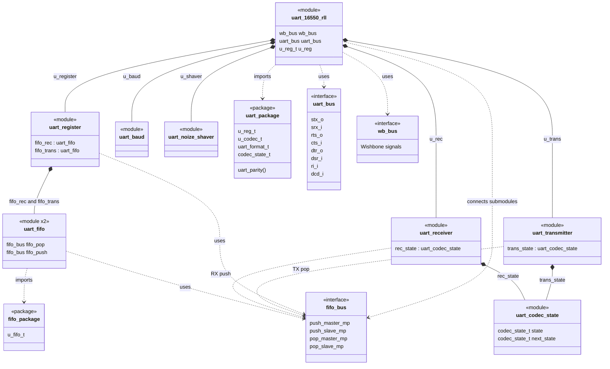

# UART module structure

This diagram reflects the current RTL instance hierarchy and the principal
package/interface dependencies.

## Notes

- `uart_register` owns two `uart_fifo` instances: `fifo_rec` and `fifo_trans`.
- `uart_transmitter` does not own the transmit FIFO; it accesses it through a
  `fifo_bus` instance created by `uart_16550_rll`.
- `uart_transmitter` and `uart_receiver` each own an independent
  `uart_codec_state` instance.
- `uart_bus` and `wb_bus` are both declared in `rtl/uart_interface.sv`.
