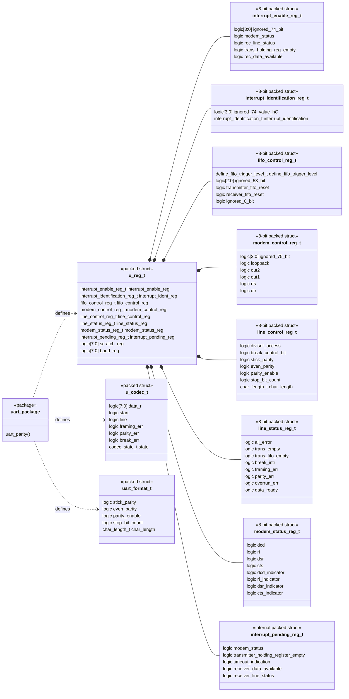

# UART register structure

This diagram reflects the packed types currently defined in
`rtl/uart_package.sv`.

## Implementation notes

- `u_reg_t` is an exported snapshot assembled from the independent register and
  status signals in `uart_register`; it is not a separate physical register
  bank.
- `u_codec_t` is a waveform/debug snapshot of transmitter or receiver state.
- `uart_format_t` captures the line format at the beginning of each frame so
  that an in-progress frame is not affected by later LCR writes.
- `interrupt_pending_reg_t` is internal state and is not a software-visible
  16550 register.
