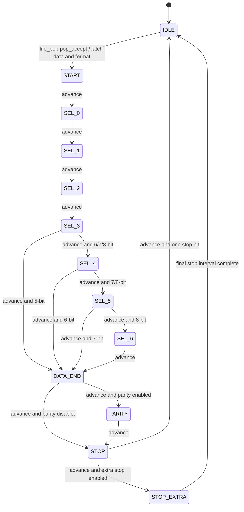
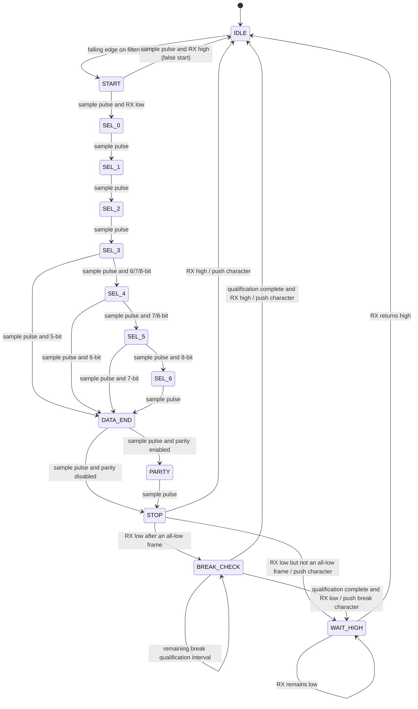
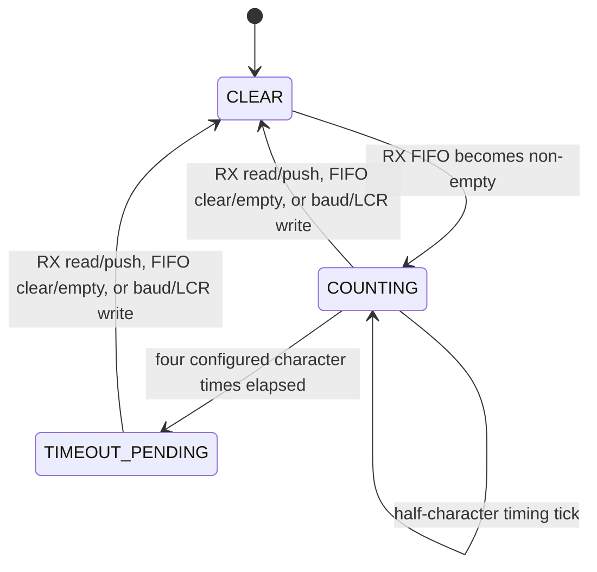

# UART state machines

The transmitter and receiver use independent state registers. Both use
`uart_codec_state` to calculate the normal frame-sequence transition, while
the receiver adds false-start, framing-error and break-handling transitions.

## Transmitter

`advance` is normally `trans_clk_en`. For a 5-bit character with 1.5 stop
bits, `STOP_EXTRA` completes on `trans_half_en`.

## Receiver

## Receive timeout

Receive timeout is not a codec state. It is measured independently in
`uart_register` while the receive FIFO is non-empty.

The legacy `TIMEOUT` value remains in `codec_state_t`, but the current TX and
RX state machines do not transition to it.
